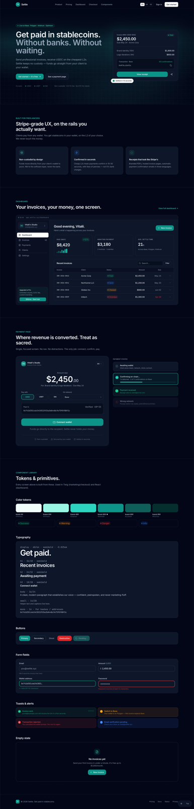

# Settle — Crypto Invoicing for Freelancers

> Get paid in stablecoins. Without banks. Without waiting. Without borders.

Settle is a SaaS platform that lets freelancers send professional invoices and get paid in **USDC / USDT / DAI** on cheap EVM L2s (**Base · Polygon · Arbitrum · Optimism**). It's built like Stripe, but on the rails freelancers in countries with broken banking actually want.

**Live domain (production):** [settlepay.pro](https://settlepay.pro)
**Status:** greenfield (May 2026 — design system + scaffold complete; backend in progress).



---

## Table of contents

1. [Why this exists](#why-this-exists)
2. [How it works (the 6-step payment flow)](#how-it-works)
3. [Architecture](#architecture)
4. [Tech stack](#tech-stack)
5. [Supported chains and tokens](#supported-chains-and-tokens)
6. [Local development with Docker](#local-development-with-docker)
7. [Project layout](#project-layout)
8. [Configuration & environment](#configuration--environment)
9. [Database schema](#database-schema)
10. [Money handling rules (read this)](#money-handling-rules-read-this)
11. [Internationalization](#internationalization)
12. [Design system](#design-system)
13. [Security model](#security-model)
14. [Deployment](#deployment)
15. [Roadmap](#roadmap)
16. [License](#license)

---

## Why this exists

Freelancers in Ukraine, Argentina, Nigeria, Pakistan, Russia/Belarus diaspora and similar markets lose **5–10% of every invoice** to SWIFT delays, frozen wires, currency conversion spreads, and platform fees. They already use crypto privately — but the tooling is awkward, custodial, or built for Web3 natives.

Settle removes the friction with a Stripe-grade UX layered over **non-custodial** stablecoin payments. We are a software facilitator, not a money transmitter — funds move directly from client wallet to freelancer wallet.

---

## How it works

```
┌─────────────┐  1. Create invoice                ┌──────────────┐
│  Freelancer ├─────────────────────────────────▶│    Settle    │
└─────┬───────┘                                  └──────┬───────┘
      │                                                 │
      │ 2. Share link                                   │ 3. Generate
      │    settle.app/pay/inv_abc123                    │    payment URL
      ▼                                                 ▼
┌─────────────┐                                  ┌──────────────┐
│   Client    │  4. Connect wallet, pick chain,  │ Public page  │
│ (any wallet)├─────── pay USDC on Base ───────▶│  (Twig + viem)│
└─────────────┘                                  └──────┬───────┘
                                                        │
                          5. eth_getLogs polling        ▼
                                                 ┌──────────────┐
                                                 │   Listener   │ ──▶ DB update
                                                 │  (PHP daemon)│ ──▶ email + receipt
                                                 └──────────────┘
                                                        │
                                                        ▼  6. < 30s
                                                ┌──────────────┐
                                                │   Dashboard  │
                                                │  (React SPA) │
                                                └──────────────┘
```

The single most important architectural decision: **Symfony writes nothing on-chain. It only reads.** All transactions are signed in the user's browser by their wallet. This keeps Settle out of money-transmitter regulation territory and dramatically simplifies the codebase.

---

## Architecture

```
┌─────────────────────────────────────────────────────────────┐
│                     Hetzner server                          │
│                                                             │
│  ┌──────────┐   ┌─────────────┐   ┌──────────────────────┐  │
│  │  nginx   │──▶│ Symfony app │──▶│      MariaDB         │  │
│  │  + TLS   │   │  (PHP-FPM)  │   │  invoices/users/...  │  │
│  └──────────┘   └──────┬──────┘   └──────────────────────┘  │
│                        │                                    │
│                        ▼                                    │
│                  ┌──────────┐    ┌──────────────────────┐   │
│                  │  Redis   │    │  systemd:            │   │
│                  │  (cache, │    │   ↳ messenger worker │   │
│                  │   queue) │    │   ↳ chain-listener   │   │
│                  └──────────┘    └──────────────────────┘   │
└─────────────────────────────────────────────────────────────┘
                           │
                           ▼  HTTPS — JSON-RPC
              ┌────────────────────────┐
              │  Alchemy / QuickNode   │
              │  Base · Polygon ·      │
              │  Arbitrum · Optimism   │
              └────────────────────────┘

  Browsers:
    Marketing (Twig, multilingual)            ─ public
    Public payment page (Twig + viem/wagmi)   ─ public
    Dashboard (React SPA, served by Symfony)  ─ authenticated
```

### Why the stack looks this way

- **Twig for marketing & checkout** → server-rendered, fast, SEO-friendly, no JS framework needed for the conversion-critical payment page.
- **React SPA for the dashboard** → complex, stateful UI (invoice CRUD, real-time payment updates) where SPA pays off.
- **MariaDB, not PostgreSQL** → existing Hetzner server already runs MariaDB; the invoicing workload doesn't need PG-specific features.
- **PHP for the listener** → keeps the whole codebase in one language. Listeners don't need raw throughput; latency budget is "seconds, not milliseconds."
- **No custom smart contracts (MVP)** → we use existing ERC-20 tokens and read on-chain events. Zero Solidity surface area = zero deploy risk.

---

## Tech stack

### Backend

| Layer | Choice |
|---|---|
| Language | **PHP 8.3+** |
| Framework | **Symfony 7.1 (LTS)** + Doctrine ORM 3.x + Twig 3.x |
| Async jobs | **Symfony Messenger** (Doctrine transport in dev, Redis later) |
| Email | **Symfony Mailer** with Resend or Postmark |
| Auth | Symfony Security + email/password (SIWE in phase 2) |
| Big numbers | `bcmath` and `gmp` extensions (no float math for money) |

### Frontend

| Layer | Choice |
|---|---|
| Marketing & checkout | **Twig** server-rendered, **Tailwind CSS 4.x** |
| Dashboard | **React 18** + **TypeScript strict** + **Vite 5** |
| State / data | TanStack Query, Zustand-style local store as needed |
| Wallet | **viem** + **wagmi** + **RainbowKit** (MetaMask, Coinbase Wallet, WalletConnect) |
| i18n | `react-i18next` (dashboard), Symfony Translator (server) |

### Infra

| Layer | Choice |
|---|---|
| Production host | Hetzner dedicated, Ubuntu 24.04 |
| Web server | nginx (aaPanel-managed) |
| Process supervisor | systemd (listener + messenger workers) |
| TLS / DDoS | Cloudflare in front, Let's Encrypt origin |
| RPC providers | Alchemy / QuickNode (free tier OK for MVP) |
| Errors / observability | Sentry + Symfony Monolog |
| Email | Resend (transactional) |

---

## Supported chains and tokens

We focus on cheap, fast EVM L2s. **No Ethereum mainnet in MVP** — gas is too expensive for invoice-size payments.

| Chain | Chain ID | Confirmations | Native USDC |
|---|---|---|---|
| Base | 8453 | 5 | ✅ |
| Polygon PoS | 137 | 30 | ✅ |
| Arbitrum One | 42161 | 5 | ✅ |
| Optimism | 10 | 5 | ✅ |

**Tokens accepted:** USDC (6 decimals), USDT (6), DAI (18). All addresses are **explicitly allowlisted** in [`config/tokens.yaml`](config/tokens.yaml). Any incoming `Transfer` event from a contract NOT on the allowlist is ignored — even if the symbol matches.

Testnets used during development: **Base Sepolia** (84532), **Optimism Sepolia** (11155420), **Arbitrum Sepolia** (421614). Configured in [`config/chains.yaml`](config/chains.yaml).

---

## Local development with Docker

### Prerequisites

- Docker Desktop or OrbStack
- `make` (every system already has it)

### One-time setup

```bash
git clone https://github.com/kindrakevich-agency/settlepay.pro.git
cd settlepay.pro

cp .env.example .env.local
# Edit .env.local and set APP_SECRET (any random 32-char hex) + RPC URLs if you have Alchemy keys

make up           # Start db, redis, php-fpm, nginx, node containers
make install      # composer install + pnpm install + db create + migrate
```

You'll get:

| URL | What |
|---|---|
| http://localhost:8080 | Symfony app (marketing, payment page, dashboard shell) |
| http://localhost:5173 | Vite dev server (HMR for Tailwind + React) — start with `make dev-front` |

### Day-to-day commands

```bash
make help          # full command list
make up            # start the stack
make down          # stop everything
make logs s=php    # tail logs for one service
make shell         # bash inside the PHP container
make migrate       # apply pending migrations
make migration     # generate a migration from entity diff
make cc            # symfony cache:clear
make test          # phpunit
make dev-front     # vite dev (HMR)
make build-front   # vite build → public/build/
make worker        # foreground messenger worker
make listener      # foreground chain listener (testnet)
```

### Local docker stack

`compose.yaml` defines:

- **php** — `php:8.3-fpm-alpine` with `pdo_mysql`, `bcmath`, `gmp`, `intl`, `mbstring`, `redis`, `opcache`. Composer 2 baked in.
- **nginx** — `nginx:1.27-alpine`, serves `public/` on `:8080`.
- **db** — `mariadb:10.11`, healthcheck-gated startup.
- **redis** — `redis:7-alpine`, persistent (`appendonly`).
- **node** — `node:22-alpine` for Vite/Tailwind builds, exposes `:5173`.
- **worker** — `messenger:consume async` (started on demand).
- **listener** — `app:chain:listen --testnet` (started on demand).

---

## Project layout

```
settlepay.pro/
├── assets/                      # Frontend source (Tailwind + React + checkout TS)
│   ├── styles/app.css           # Tailwind 4 entry + design tokens
│   ├── checkout/checkout.ts     # Public payment page (viem + wagmi)
│   └── dashboard/main.tsx       # React SPA entry
├── bin/console                  # Symfony CLI
├── compose.yaml                 # Local docker stack
├── config/
│   ├── packages/                # framework, doctrine, security, twig, mailer, ...
│   ├── chains.yaml              # RPC URLs, confirmations, block times per chain
│   ├── tokens.yaml              # Allowlisted ERC-20 contracts (public, safe to commit)
│   ├── routes.yaml
│   └── services.yaml
├── docker/
│   ├── nginx/default.conf       # nginx config for local
│   └── php/Dockerfile           # PHP 8.3-fpm + extensions
├── docs/
│   ├── DESIGN_SYSTEM.md         # Tokens, components, accessibility floor
│   ├── design-preview.html      # Self-contained visual showcase
│   └── screenshot.png/.webp     # README hero
├── migrations/                  # Doctrine migrations
├── public/index.php             # Front controller
├── src/
│   ├── Controller/              # Marketing, Auth, Public, Api, Dashboard
│   ├── Entity/                  # Doctrine entities (User, Invoice, Payment, ...)
│   ├── Service/                 # Domain logic
│   │   ├── Blockchain/          # RpcClient, EventDecoder, BlockListener
│   │   ├── Invoice/             # Factory, NumberGenerator, PdfRenderer
│   │   ├── Payment/             # Matcher, Validator, StatusUpdater
│   │   └── Pricing/             # CoinGecko client
│   ├── Message/                 # Symfony Messenger commands
│   ├── MessageHandler/
│   ├── Command/                 # bin/console app:chain:listen, etc.
│   └── Kernel.php
├── templates/
│   ├── base.html.twig
│   ├── marketing/               # Multilingual marketing pages
│   ├── payment/checkout.html.twig  # The public payment page (sacred)
│   ├── pdf/                     # PDF templates
│   └── emails/
├── translations/
│   ├── messages.en.yaml
│   ├── messages.uk.yaml
│   └── messages.es.yaml
├── tailwind.config.js
├── tsconfig.json
├── vite.config.ts
├── Makefile
├── CLAUDE.md                    # Source-of-truth spec for AI agents and contributors
└── README.md
```

---

## Configuration & environment

Two files:

| File | Purpose | Committed? |
|---|---|---|
| `.env` | Non-sensitive defaults (public RPC URLs, `APP_ENV=dev`, container hostnames) | ✅ yes |
| `.env.local` | Real secrets (`APP_SECRET`, DB password, Alchemy/Resend keys, Stripe key) | ❌ **never** |

This is the standard Symfony [`.env` workflow](https://symfony.com/doc/current/configuration.html#configuration-environments). The `.gitignore` excludes `.env.local*`, `*.pem`, `*.key`, and SSH keys outright. Production secrets travel via **GitHub Actions Secrets** for CI/CD and live in `.env.local` on the server.

### Generate a fresh `APP_SECRET`

```bash
php -r 'echo bin2hex(random_bytes(16));'
```

---

## Database schema

Initial schema lives in `migrations/Version20260509120000.php`. Tables (MariaDB, `utf8mb4_unicode_ci`, InnoDB):

| Table | Purpose |
|---|---|
| `users` | Account, payout wallet/chain/token, plan |
| `invoices` | Invoice header, status enum, accepted chains/tokens (JSON), recipient address snapshot |
| `invoice_line_items` | Itemized rows |
| `payments` | On-chain receipts, unique by `(chain_id, tx_hash, log_index)` |
| `chain_cursors` | Per-chain "last processed block" — listener resume point |
| `webhooks` | User-configurable outgoing event hooks (HMAC-signed) |
| `audit_log` | Every state-changing action |

See [`CLAUDE.md` §6](CLAUDE.md) for column-by-column rationale and indexing.

---

## Money handling rules (read this)

These are non-negotiable. Money bugs caused by floats are the #1 incident class in payment systems.

1. **Always store amounts as integer cents.** Never `FLOAT` or `DECIMAL` for fiat money in PHP/JS interop.
2. **For on-chain amounts**, store the raw uint256 as a **string** in `payments.amount_raw`. Compute display values from `amount_raw` + `token_decimals` at the application layer.
3. **All money math uses integer arithmetic.** Use `bcmath` or `gmp` for big numbers. Never `*` or `/` floats for money.
4. **USD conversion** uses snapshot price at confirmation time, stored in `amount_usd_cents`. We never recalculate retroactively.
5. **Token allowlist is enforced** on every match. Symbol-only match is forbidden — contract address must be in `config/tokens.yaml`.
6. **Wallet addresses are validated** with EIP-55 checksum, then stored lowercase. Tx hashes are stored lowercase.

---

## Internationalization

Three locales from day one: **English (en)**, **Ukrainian (uk)**, **Spanish (es)**.

- URL strategy: `/{locale}/...` (`/en/pricing`, `/uk/pricing`, `/es/pricing`).
- Translation files: [`translations/messages.{en,uk,es}.yaml`](translations/) — kept in sync, identical key trees.
- Money/date formatting: **always `Intl.NumberFormat` / `format_currency` Twig filter**. Never concatenate currency symbols (`1 234,56 €` vs `$1,234.56` is locale-dependent).
- React dashboard: `react-i18next` with JSON files in `assets/dashboard/i18n/{en,uk,es}.json` (mirror server keys).
- Pluralization uses ICU MessageFormat where needed; Slavic plural rules require it.

---

## Design system

A complete visual & token reference is in [`docs/DESIGN_SYSTEM.md`](docs/DESIGN_SYSTEM.md), and a self-contained interactive showcase is at [`docs/design-preview.html`](docs/design-preview.html) — open it directly in a browser to see every component, both light and dark mode, with a working locale switcher.

### Quick reference

- **Brand:** deep teal `#0d9488` (`brand-600`). Distinct from generic SaaS blue, signals fintech trust without crypto-bro neon.
- **Reference points:** Stripe (clarity), Linear (refinement), Vercel (typography), Coinbase (crypto credibility without clichés).
- **Type:** Inter (UI/body, weights 400/500/600/700), Inter Display (large headings), JetBrains Mono (hashes, addresses, invoice numbers).
- **Geometry:** rounded-xl/2xl/3xl. 4/8 spacing rhythm.
- **Status colors:** `success`, `warning`, `danger`, `info` — only on badges, alerts, explicit indicators. Never decoration.
- **Dark mode:** designed in parallel from day one. Both modes verified for WCAG AA contrast (4.5:1 body / 3:1 large).
- **Motion:** 150ms `ease-out` for hover/focus, 240ms `cubic-bezier(0.16, 1, 0.3, 1)` for layout. `prefers-reduced-motion` always respected.
- **Accessibility floor:** 44pt touch targets, focus rings everywhere, label-for everywhere, semantic HTML, color never the only carrier of meaning.

---

## Security model

| Concern | Mitigation |
|---|---|
| HTTPS | TLS only, HSTS preload (production) |
| CSP | Strict policy; inline scripts only where the wallet checkout requires them |
| CSRF | Symfony CSRF tokens on all forms |
| SQL injection | Doctrine ORM only — raw queries reviewed |
| Password hashing | Argon2id, min 12 chars |
| Rate limiting | Symfony RateLimiter + Redis: 5 login attempts / 15 min / IP, 60 public-page hits / min / IP |
| Token contract allowlist | Enforced on every payment match (config/tokens.yaml) |
| Wallet address validation | EIP-55 checksum, then stored lowercase |
| Secrets | `.env.local` only (chmod 600 in prod), never committed |
| PII in logs | Email + wallet addresses masked in production logs |
| Webhook signatures | HMAC-SHA256 |
| PDF generation | All user input sanitized — no XSS via SVG |
| CORS | Strictly configured to dashboard origin only |
| Audit log | Every state-changing operation logged with user/IP/UA |

---

## Deployment

Deploys are handled by **GitHub Actions** (`.github/workflows/deploy.yml`) using `appleboy/ssh-action` to SSH into the Hetzner server. Pattern is identical to [the existing Tripsquick & st-ai.com.ua deployments](https://github.com/kindrakevich-agency).

**On every push to `main`:**

1. SSH into the production server
2. Backup any production-only data (uploads, .env.local)
3. `git fetch && git reset --hard origin/main`
4. `composer install --no-dev --optimize-autoloader`
5. `php bin/console doctrine:migrations:migrate --no-interaction`
6. `php bin/console cache:clear` + `cache:warmup`
7. `pnpm install --frozen-lockfile && pnpm build`
8. `php bin/console asset-map:compile`
9. Restart messenger workers + listener via systemd

**Required GitHub Secrets** (set under repo → Settings → Secrets):

- `SERVER_IP` — Hetzner public IP
- `SSH_PRIVATE_KEY` — deploy key with access to the server's `settle` user

**Server-side setup** (one-off): a deploy SSH key at `/root/.ssh/github_settle_deploy`, an aaPanel site for `settlepay.pro`, a MariaDB database, and systemd units for `settle-listener` and `settle-worker@1` (templates in `CLAUDE.md` §15).

---

## Roadmap

8-week MVP plan (full week-by-week breakdown in [`CLAUDE.md` §17](CLAUDE.md)):

| Week | Deliverable |
|---|---|
| 1 | Foundation: skeleton, auth, marketing landing (en/uk/es) |
| 2 | Invoice CRUD, public invoice view, PDF + email |
| 3 | Crypto checkout (testnet): viem + wagmi + RainbowKit |
| 4 | Chain listener: `eth_getLogs` polling, payment matching |
| 5 | Mainnet flip, Sentry, basic monitoring, webhooks v1 |
| 6 | Full i18n: uk + es complete, locale-aware money/date |
| 7 | Beta with 10–20 freelancers, onboarding polish |
| 8 | Public launch (Product Hunt, Indie Hackers, X) |

---

## License

MIT — see [LICENSE](LICENSE).

---

## Contributing & contact

Solo founder build by **Vitalii** ([@kindrakevich-agency](https://github.com/kindrakevich-agency)). PRs and issues welcome once the MVP ships. For freelancers who want to be in the closed beta — reach out via the issue tracker.
